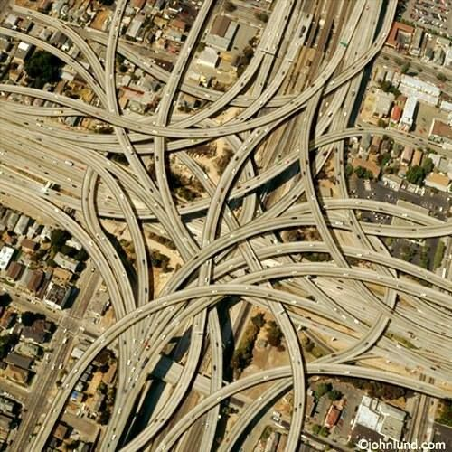
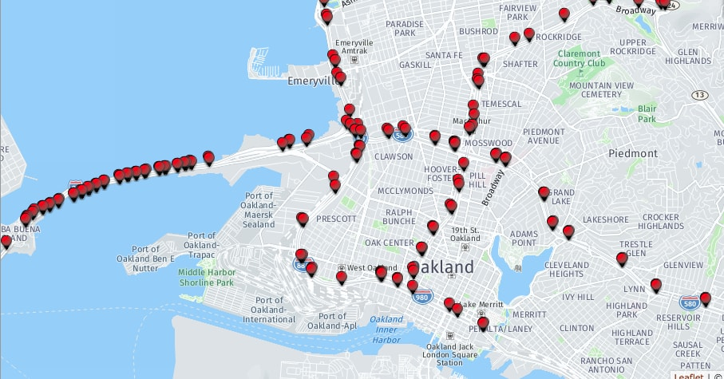
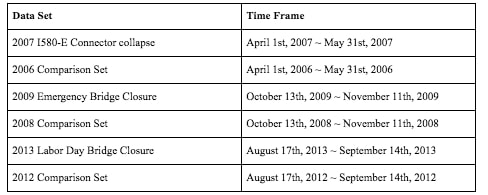
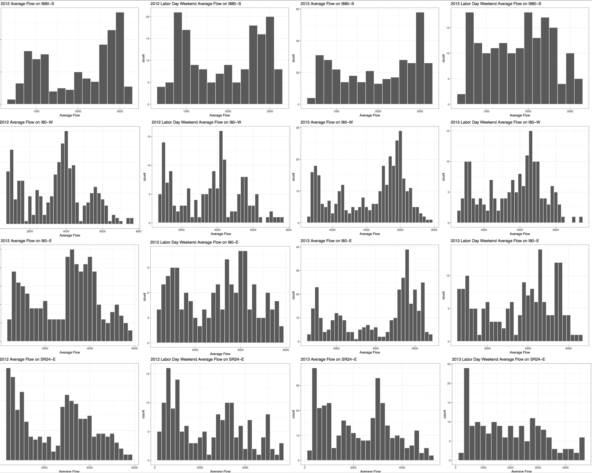

# The MacArthur Maze
   
The MacArthur Maze is an intersection of five different freeways: the I880, I980, I580, I80, SR24. It is unique because there are multiple route options to reach destinations of interest. So, if a particular freeway on the Maze is heavily congested or closed, other routes can still be utilized. 

# Question
How do freeway closures on the MacArthur Maze influence traffic behavior on the Maze and its freeways? What alternatives freeways are taken due to a closure?

# Data
Our data was collected from the State of California PeMS website. This data consists of hourly traffic flow (vehicles per hour) and delay (extra time traveled caused by traffic speed under 60mph)for sections of the freeways on and near the Maze for multiple time frames approximately a month long containing the following events: the 2007 I-580 East Connector collapse, the 2009 Emergency Bridge Closure, and the 2013 Labor Day Bridge Closure. Data was collected from previous years of the events to use for comparison.  
 
 

# Results
### 2007 I-580 Connector Collapse   
### 2009 Emergency Bay Bridge Closure  
On Wednesday, October 27, during the evening commute, the new cross beams installed during the 2009 Labor Day Bay Bridge restoration project came crashing down and caused the bridge to remain closed until the morning of Monday, November 2. The proposed cause of this failure was likely due to the 55 mile per hour wind gusts that ensued on the night of the bridge failure. In order to see how traffic patterns diverged as a result of this incident, we decided to analyze the effects of the Bay Bridge closure on other bridges into San Francisco. The bridges we looked at are as follows: Richmond (A on map), San Mateo (C on map), Dumbarton (D on map). 

### 2013 Labor Day Closure    
The 2013 Labor Day Bay Bridge closure was planned ahead of time, unlike the 2009 emergency closure, thus allowing local residents and commuters to strategize their travel arrangements during the closure. The closure extended from Wednesday, August 28 to Tuesday, September 3. 
  

As seen in the following histograms, the bridge closure in 2013 certainly impacted these four freeways significantly more than the effects of just the holiday weekend, as observed in 2012. This is likely a direct result of the Bay Bridge closure, as the bridge lies on the I80. As for SR24, many people from east of the bay area may be avoiding the MacArthur Maze altogether due to the closure of the Bay Bridge. This means that fewer people will be taking this route to and from the bay area, explaining the substantial decline in use during the 2013 Labor Day Weekend. This decline in external commuters entering the Maze in the first place could part of the reason that the I880-S, in particular, sees far lower use as well. The I880-S can be used as a route towards the San Mateo Bridge as an alternative means of entrance into San Francisco, implying a potential increase in use, but, due to the lower traffic into the East Bay in general, this alternative route goes unused. 

 
 

# Conclusion
